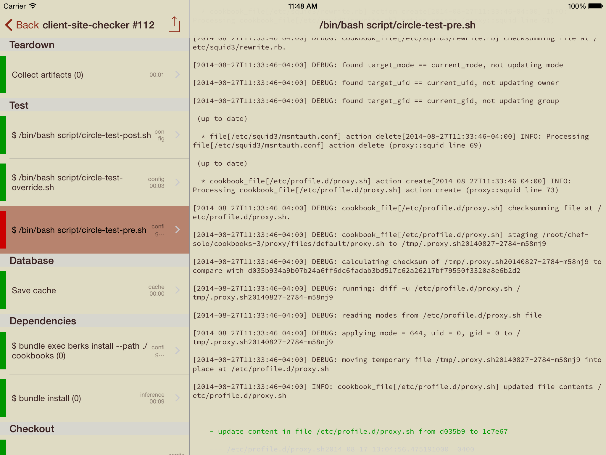
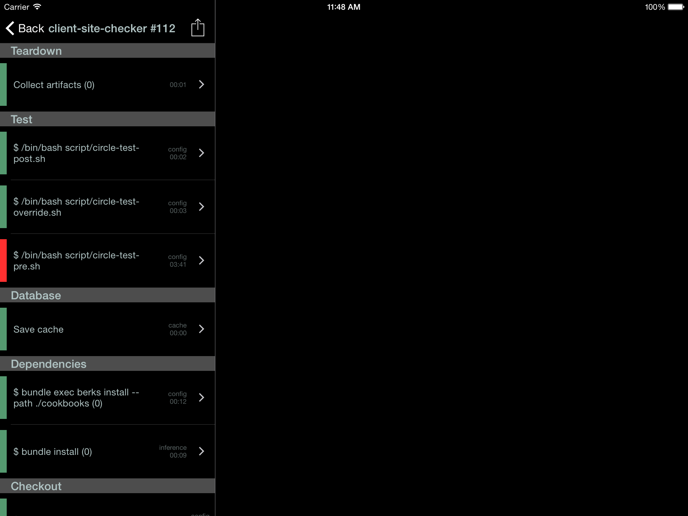
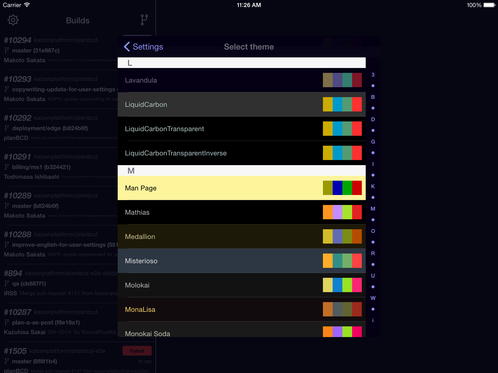
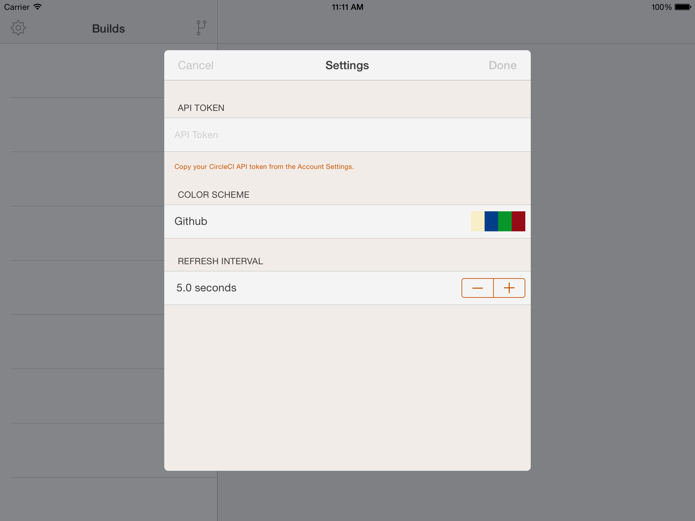

CI2Go
=====

CI2Go is a CircleCI client for iOS.

&nbsp;
&nbsp;
&nbsp;
&nbsp;

Author
======

[Atushi Nagase]

License
=======

Copyright &copy; 2014 [Atushi Nagase]. All rights reserved.

[Atushi Nagase]: http://ngs.io/
