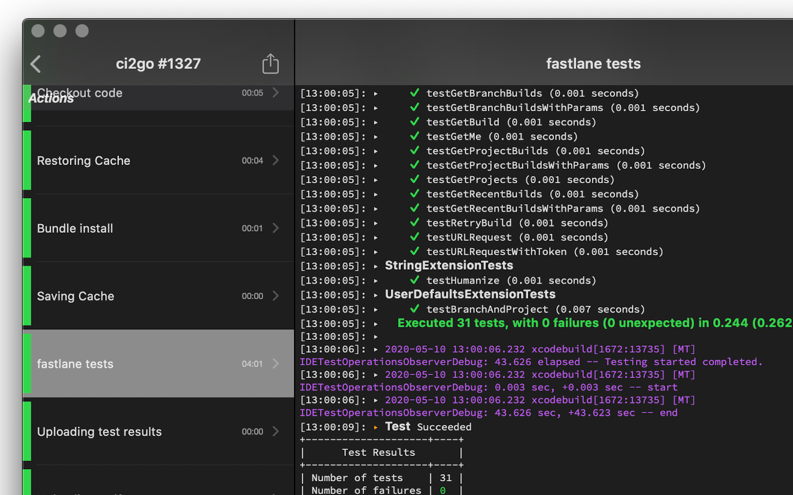

CI2Go the CircleCI Client
==========================

**CI2Go** is a [CircleCI] client for iPhone, iPad, Apple Watch and Mac.

https://ci2go.app

Author
======

[Atushi Nagase]

License
=======

Copyright &copy; 2014-2020 [Atushi Nagase]. All rights reserved.

[Atushi Nagase]: https://ngs.io/
[CircleCI]: https://circleci.com/
